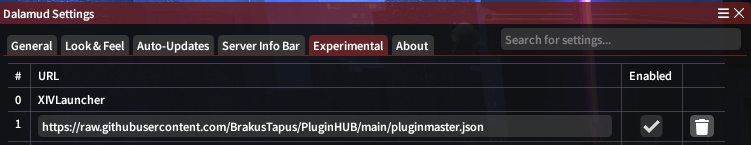

# PluginHUB 

----------

**To use my plugins you'll need to add this link in your Dalamud settings.**

```c#
https://raw.githubusercontent.com/BrakusTapus/PluginHUB/main/pluginmaster.json
```



----------

## Current Plugins

| <div align="center"></div> | <div align="center"></div> |
|---|---|
| <div align="center">[](https://github.com/BrakusTapus/BetterTargetingSystemPvP)</div> | <div align="center">[](https://github.com/BrakusTapus/Plugin)</div> |
| <div align="center">PvP Enabled</div> | <div align="center">All-Round</div> |
| <div align="center"></div> | <div align="center"></div> |
| <div align="center"></div> | <div align="center"></div> |
| <div align="center"></div> | <div align="center"></div> |
| <div align="center"></div> | <div align="center"></div> |
| <div align="center"></div> | <div align="center"></div> |
| <div align="center"></div> | <div align="center"></div> |

----------

<!--
|[](https://github.com/BrakusTapus/BetterTargetingSystemPvP) | [](https://github.com/BrakusTapus/Plugin)  |   
|---|---|
|   |   |
|   |   |
|   |   |
|   |   |
|   |     |
|  |   |
-->

<!--|  | [](https://github.com/BrakusTapus/ActionTimelineEx) | Revived |  |  |  |  | -->
<!--|  | [](https://github.com/BrakusTapus/AetherBox) | WIP |  |  |  |  | -->
<!--|  | [](https://github.com/BrakusTapus/FakeName) | Revived |  |  |  |  | -->
<!--|  | [](https://github.com/BrakusTapus/SamplePlugin) | Test Plugin |  |  |  |  |--!>
<!--
###  
### [](https://github.com/BrakusTapus/SamplePlugin) 
### | Test Plugin | 
###  
###  
###  
### 

# Shields
License: Displays the license type of your project.


GitHub Forks: Shows the number of times your SamplePluginsitory has been forked.


GitHub Last Commit: Displays the date of the last commit.
|  |
-->
